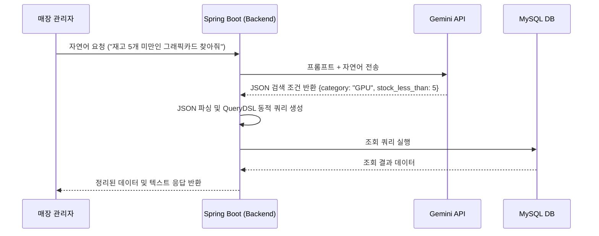
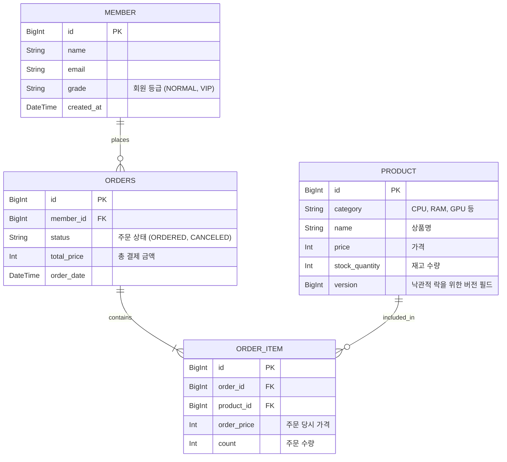

# AI-CRM-PIM-
매장 관리자가 챗봇에게 "최근 한 달간 100만 원 이상 구매한 VIP 고객 목록 뽑아주고, 이들에게 신상품 할인 안내 문자 발송해 줘" 또는 "현재 재고가 10개 미만인 상품들 발주 리스트 만들어 줘"라고 자연어로 요청하면, AI가 의도를 파악해 백엔드에서 복잡한 DB 쿼리를 수행하고 결과를 반환하는 시스템.

# 개발 환경
Project: Gradle - Kotlin DSL

Language: Java 21

Spring Boot: 4.1.1

Packaging: Jar

DB: MySQL 8 (JPA + QueryDSL 5)

AI: Google Gemini API

# 실행 방법
환경변수 `DB_PASSWORD`(로컬 MySQL root 비밀번호)와 `GEMINI_API_KEY`를 설정한 뒤 실행합니다.

```bash
cd ai_crm_pim
./gradlew bootRun
```

# 기능 정의서
## 🚀 주요 기능 및 백엔드 어필 포인트

| 기능 구분 | 세부 기능명 | 기능 설명 | 백엔드 어필 포인트 (포트폴리오용) |
| :--- | :--- | :--- | :--- |
| **AI 연동** | 자연어 검색 조건 변환 | "최근 1달간 RTX 4090을 구매한 VIP 회원 찾아줘"라는 텍스트를 Gemini API로 분석해 JSON 형태의 검색 조건으로 변환 | 프롬프트 엔지니어링, 외부 API 통신 및 예외 처리 |
| **고객 관리** | AI 기반 동적 쿼리 검색 | AI가 파싱해준 조건(기간, 상품명, 결제금액 등)을 바탕으로 고객 리스트를 유동적으로 조회 | QueryDSL을 활용한 동적 쿼리 구현 |
| **주문/결제** | 대용량 주문 내역 조회 | 100만 건 이상의 더미 주문 데이터에서 특정 조건의 통계 및 리스트를 빠르게 추출 | 실행 계획(EXPLAIN) 분석 및 복합 인덱스(Index) 튜닝을 통한 속도 개선 |
| **재고 관리** | 동시성 제어 적용 재고 차감 | 인기 하드웨어(예: 특가 RAM, CPU)에 동시 주문이 몰릴 때, 재고가 마이너스가 되지 않도록 안전하게 차감 | 비관적 락(Pessimistic Lock) / 낙관적 락(Optimistic Lock) 테스트 및 성능 비교 |
| **주문/결제** | 트랜잭션 롤백 테스트 | 다중 고객의 주문 처리 중, 특정 고객 결제 실패 시 전체 혹은 부분 롤백 처리 | `@Transactional`의 깊은 이해, 데이터 정합성 보장 |

# 시스템 구성도

# UML

